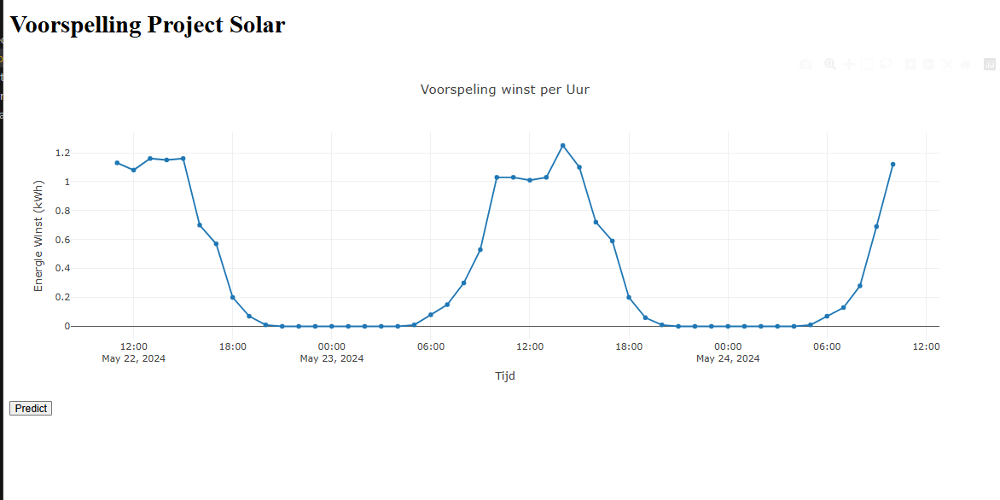

# ML Solar Prediction Project

## Project Overview
This project is designed to predict solar energy generation per hour using machine learning. It leverages weather forecasts and sunrise/sunset data to provide accurate energy production estimates. The project consists of three main components:

1. **MakenPredictie.py**: A script that loads the trained machine learning model, processes input data, and predicts solar energy output.
2. **MakenDash.py**: A Dash web application that visualizes solar energy predictions interactively.
3. **Jupyter Notebook (`solarFinal.ipynb`)**: Used to train and evaluate different machine learning models to find the best performing model.



## Technologies Used
- **Python**
- **pandas** (for data handling)
- **NumPy** (for numerical operations)
- **Joblib** (for model loading)
- **Dash & Plotly** (for web-based visualization)
- **Jupyter Notebook** (for model experimentation)

## Installation
To run this project, ensure you have the required dependencies installed:

```sh
pip install pandas numpy joblib dash plotly openpyxl
```

## How It Works
### Prediction Script (**MakenPredictie.py**)
1. Loads weather forecast data from an Excel file.
2. Loads sunrise/sunset timing data.
3. Preprocesses and merges the datasets.
4. Extracts relevant features such as temperature, pressure, cloudiness, and time-based variables.
5. Uses a trained ML model (`BesteModel.pkl`) to predict hourly energy generation.
6. Prints the predicted energy production in kWh.

### Web Dashboard (**MakenDash.py**)
1. Implements a **Dash** web application.
2. Displays an interactive graph showing solar energy predictions over time.
3. Uses a "Predict" button to trigger model predictions dynamically.
4. Visualizes hourly energy forecasts using Plotly.

### Model Training (**solarFinal.ipynb**)
1. Explores multiple machine learning models.
2. Evaluates model performance using appropriate metrics.
3. Selects and saves the best-performing model for prediction.

## Running the Project
### Running the Prediction Script
To execute the standalone prediction script, run:
```sh
python MakenPredictie.py
```

### Running the Web Dashboard
To start the Dash application, run:
```sh
python MakenDash.py
```
Then, open a browser and navigate to `http://127.0.0.1:8050` to view the dashboard.

## Input Data
The project relies on the following input files:
- **Weather Forecast Data (`forecast5.xlsx`)**: Contains weather conditions such as temperature, pressure, cloudiness, and humidity.
- **Sunrise-Sunset Data (`sunrise-sunset.xlsx`)**: Contains daily sunrise, sunset, and solar noon timestamps.

## Model Features
The ML model predicts energy generation using these features:
- Temperature
- Pressure
- Cloudiness
- Humidity
- Hour, Day, and Month
- Day Length
- Solar Noon Distance

## Future Improvements
- Integrate real-time weather API data.
- Deploy the dashboard as a web service.
- Optimize feature engineering for better accuracy.

## Author
This project was developed for **solar energy prediction** using machine learning techniques.
